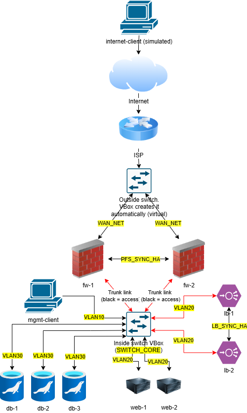
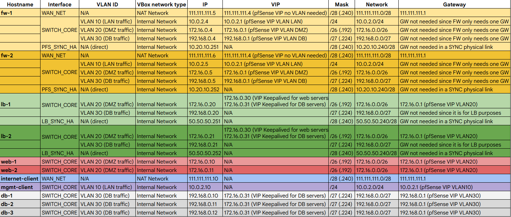

# 🚀 Lab title: deploying a professional IT infrastructure

## 📋 Overview

> With this lab, the deployment procedure of a professional IT infrastructure will be shown

## 📑 Table of contents
* [1. Technical Stack](#technical-stack)
* [2. Topology Diagram and IP Addresses](#topology-diagram-and-ip-addresses)
* [3. Implementation Step-by-Step](#implementation-step-by-step)
    * [3.1. Phase 1](#phase-1)

## Technical stack
- **Firewall:** pfSense cluster
- **Database:** MariaDB Galera Cluster (3 nodes)
- **Load balancing:** HAProxy and Keepalived for VIPs
- **Web servers:** Apache
- **Segmentation:** IEEE 802.1Q VLANs (VLAN 10, 20, 30)
- **Hypervisor:** VirtualBox (with Promiscuous Mode enabled for HA traffic)

## Topology diagram and IP addresses

## Implementation step-by-step

### Phase 1

Text.