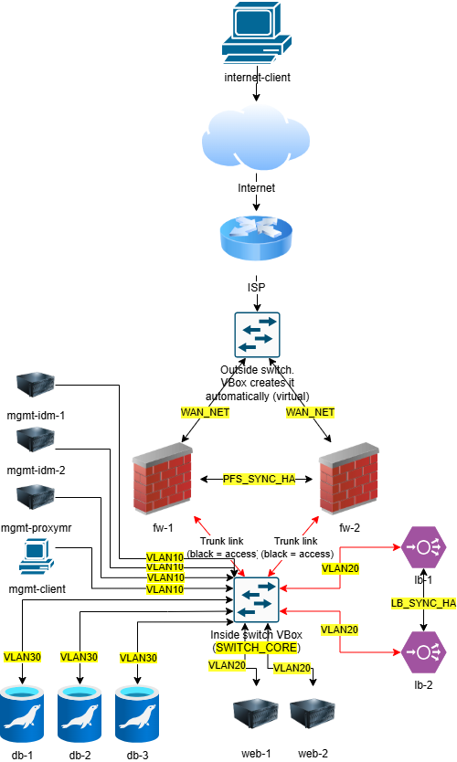
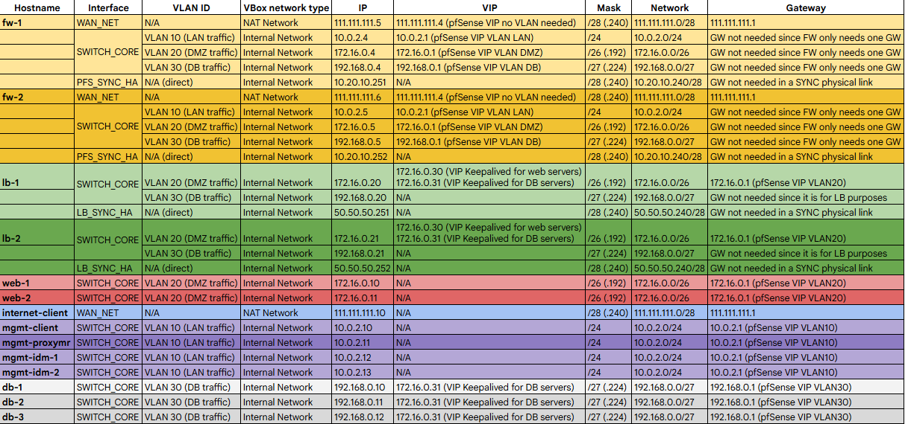

# Professional IT infrastructure

## 📋 Introduction

> In this lab, the deployment of a professional IT infrastructure will be shown.
>
> This is a real lab that I deployed while studying Computer Systems and Network Administration (educational level of "Ciclo Formativo de Grado Superior" in Spain). This lab took me hours and I am very proud of it. I still keep a backup of all the VMs.
## Infrastructure that will be deployed

- **Firewall and VPN:** pfSense cluster (2 nodes)
- **Database:** MariaDB Galera Cluster (3 nodes)
- **Load balancing:** HAProxy and Keepalived for VIPs (2 nodes)
- **Web servers:** Apache (2 nodes)
- **IAM and DNS:** FreeIPA (2 nodes)
- **Web filtering:** Squid proxy (1 node)
- **Management:** management client to manage the whole infrastructure (1 node)
- **Other:** internet client to connect to the infrastructure via VPN (1 node)
- **Segmentation:** IEEE 802.1Q VLANs (VLAN 10, 20, 30)
- **Hypervisor to run all the servers:** VirtualBox (with Promiscuous Mode enabled for HA traffic)
## Networking topology and IP addresses

## Summarized step-by-step procedure of implementation

### Phase 1 - Initial configuration of the firewalls

Download the pfSense ISO image and create two virtual machines for it in VirtualBox. Those two virtual machines must have three network adapters: one for WAN, the other for the internal network (VLANs) and the last one for the future HA with another pfSense node.
### Phase 2 - Create the VMs for the web servers, load balancers, internet-client and mgmt-client

Download the ISO images of light Linux distributions (Debian 13 without GUI). Once the OS deployed, install the packages that allow the lab simulate the VLAN tagging. Furthermore, it is necessary to assign static IPs to the servers following the logic of the addressing tab.
### Phase 3 - Configure the firewall cluster

Create the basic allow rules and set up CARP for high availability between firewall nodes. The rules must be scalable and follow good practices. A network firewall by default denies all networking traffic of the directly connected interfaces. Therefore, it is necessary to create basic allow rules.
### Phase 4 - Configure the web cluster

The two nodes will have Apache installed as well as GlusterFS to locate resources in a single logical shared space. The content of the web page will be a basic counter that will increment itself after every time the page refreshes (both nodes will display the same information when refreshing).
### Phase 5 - Configure the load balancing cluster

Install HAProxy and Keepalived for VIPs. A self-signed certificate has to be generated in the two load balancers, as well as a maintenance page. It is important to implement a robust configuration file. After deploying, it is necessary to test that both IPs display the page with HTTPS.
### Phase 6 - Execute failover test for the created servers so far

This is where Keepalived does its work. What I did was creating a NAT rule in the firewall to make the load balancer VIP for the web cluster accessible. After every test, it is necessary to check that there is no split-brain in Keepalived. This is achived when there's an appropriate configuration.
### Phase 7 - Deploy and configure the database servers

As done in the initial stage, it is necessary to deploy three Linux servers. This time, MariaDB must be installed. Moreover, configure basic security settings using the command "mysql_secure_installation". For the moment, no configuration regarding HA is needed.
### Phase 8 - Configure the firewall for the database servers

It is necessary to create the VLAN in pfSense and the rules that will allow restricted internet access to the database servers. As well as the rules to manage the servers via SSH from the machine "mgmt-client". This step is done after any new group of servers or network segment is created.
### Phase 9 - Implement high availability in the database servers

Here is where MariaDB Galera Cluster with HAProxy takes the protagonism. MariaDB Galera Cluster requires minimum three nodes to operate. After implementing the MariaDB HA solution, it is essential to verify synchronous replication and correct quorum status among all the nodes.
### Phase 10 - Make the web servers utilize the remote databases

Instead of a local storage location or GlusterFS, now it is time for the web servers to point to the database cluster VIP for storing data. In this step the web code must be changed to implement PHP. Here I changed the counter for a log of connections that I will use to test high availability.
### Phase 11 - Install OpenVPN in the firewall cluster

With the open source solution of OpenVPN, I will make the whole infrastructure accessible by the server "internet-client". This is one of the most powerful stages of the project where remote and secure connectivity can be established. As well as in real life, the VPN is in the firewall cluster.
### Phase 12 - Make the remote client able to connect to the infrastructure via VPN

As simple as transferring the credentials to the remote client and creating a user for him in the VPN. It is important that the remote client also gets the DNS IPs for the name resolution. Otherwise, problems when managing the infrastructure could be had.
### Phase 13 - Web filtering with Squid proxy

At this stage I wanted to restrict more the internet access for the web servers, load balancers and DB. The proxy was included within the OS level in all the servers mentioned. It is important to opt for a default deny in the proxy for servers which are in a semi-trusted zone.
### Phase 14 - FreeIPA

Thanks to FreeIPA I centralized management of users and DNS resolutions in a single cluster. FreeIPA works in an active-active logic and it is very easy to set up once the servers have the basic requirements regarding IP addressing and basic DNS resolution.
### Possible future improvements

Implement an Ansible server for patching. Implement an OMD server for monitoring.